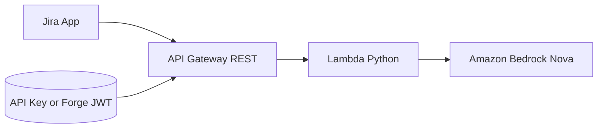

# atlassian-sprint-review-summary

Serverless API that generates **AI-driven sprint review summaries** using Amazon Bedrock. Built for Atlassian Jira integration.



## Quick Start

```bash
sam build
sam deploy --guided     # first time — picks region, auth mode, model
sam deploy              # subsequent
```

Then call the API:

```bash
curl -X POST https://<API_ID>.execute-api.eu-central-1.amazonaws.com/prod/summarize \
  -H "Content-Type: application/json" \
  -H "Authorization: Bearer <FORGE_INVOCATION_TOKEN>" \
  -d @events/summarize.json
```

If you deploy with `AuthMode=api-key`, replace the auth header with `x-api-key: <YOUR_KEY>`.

See [docs/deployment.md](docs/deployment.md) for full setup instructions.

## Documentation

| Guide | Description |
|-------|-------------|
| [Deployment](docs/deployment.md) | Prerequisites, deploy, dev setup, CI/CD |
| [API Reference](docs/api-reference.md) | `POST /summarize`, `GET /health`, schemas, errors |
| [Prompt Guide](docs/prompt-guide.md) | Edit `config.yaml`, override precedence, examples |
| [Authentication](docs/authentication.md) | API key, Forge JWT, setup for each mode |
| [Atlassian Integration](docs/atlassian-integration.md) | Forge remote, Connect backend, collecting sprint data |
| [Contributing](CONTRIBUTING.md) | Local checks and PR expectations |

Documentation is split by concern; there is intentionally no long project tree section in this README.

## Key Features

- **Cheapest Bedrock model** — Amazon Nova Micro at $0.035/1M input tokens (~$0.0002 per summary)
- **Single root config** — Edit [`config.yaml`](config.yaml) to change prompt, model defaults, auth defaults, and API defaults
- **Per-request overrides** — Temperature, max tokens, top-p, model ID, and prompt all overridable per request
- **Multiple auth modes** — API key, Forge JWT, both, or none
- **Atlassian-ready** — Works with Forge remotes and Connect backends out of the box
- **Strict JSON output** — The generated summary follows a sectioned JSON shape with 2-3 concise conclusion bullets per section, each with a `business_value_score` from `-100` to `100`

## Model Options

| Model | Cost (input/1M tokens) | ID |
|-------|----------------------|-----|
| **Nova Micro** (default) | $0.035 | `eu.amazon.nova-micro-v1:0` |
| Nova Lite | $0.06 | `eu.amazon.nova-lite-v1:0` |
| Claude 3 Haiku | $0.25 | `anthropic.claude-3-haiku-20240307-v1:0` |

Switch at deploy time: `sam deploy --parameter-overrides BedrockModelId="eu.amazon.nova-lite-v1:0"`

## Local Development

```bash
poetry install
poetry run pytest tests/ -v
```

## Management

After `poetry install`, use:

```bash
poetry run poe test
poetry run poe lint
poetry run poe format
poetry run poe build
poetry run poe invoke
poetry run poe start-api
poetry run poe deploy
poetry run poe deploy-dev
```

## Build, Test, Deploy by Environment

### 1) Install once

```bash
poetry install
```

### 2) Build and test locally

```bash
poetry run poe build
poetry run poe test
poetry run poe lint
```

### 3) Deploy to a particular environment

This project currently has two SAM config environments in `samconfig.toml`:
- `default` (prod-like)
- `dev`

Use:

```bash
# Deploy using default profile (prod-like)
poetry run poe deploy

# Deploy using dev profile
poetry run poe deploy-dev

# Equivalent raw SAM command for any profile:
sam deploy --config-env <env-name>
```

### 4) Deploy to a custom/new environment (example: staging)

1. Add a `[staging.deploy.parameters]` section in `samconfig.toml`
2. Deploy:

```bash
sam deploy --config-env staging
```

### 5) Override parameters for one deploy

```bash
sam deploy --config-env dev --parameter-overrides \
  BedrockModelId="eu.amazon.nova-lite-v1:0" \
  AuthMode="forge-jwt" \
  ForgeAppId="ari:cloud:ecosystem::app/YOUR_FORGE_APP_ID"
```

## License

MIT
