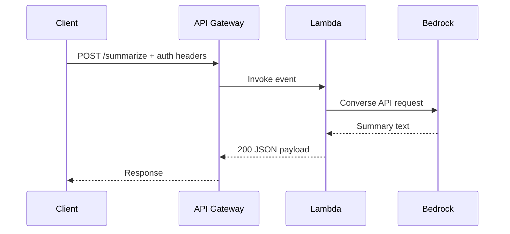

# API Reference

Base URL: `https://<API_ID>.execute-api.eu-central-1.amazonaws.com/<stage>`



## `POST /summarize`

Generate an AI-driven sprint review summary.

### Authentication

Depends on the `AuthMode` deployment parameter:

- **`api-key`** (default) — Include `x-api-key: <key>` header
- **`forge-jwt`** — Include `Authorization: Bearer <jwt>` or `x-forge-oauth-system: <jwt>` header
- **`both`** — Both headers required
- **`none`** — No auth (dev only)

### Request

```json
{
  "sprint_data": {
    "sprint": {
      "name": "Sprint 24",
      "goal": "Complete user authentication flow",
      "startDate": "2026-03-16",
      "endDate": "2026-03-27",
      "state": "closed"
    },
    "metrics": {
      "totalIssues": 18,
      "completedIssues": 14,
      "incompleteIssues": 4,
      "totalStoryPoints": 42,
      "completedStoryPoints": 34
    },
    "completedIssues": [
      {
        "key": "AUTH-101",
        "summary": "Implement OAuth2 login flow",
        "type": "Story",
        "storyPoints": 8,
        "assignee": "Alice"
      }
    ],
    "incompleteIssues": [
      {
        "key": "AUTH-103",
        "summary": "MFA setup wizard",
        "type": "Story",
        "storyPoints": 5,
        "reason": "Blocked by third-party API"
      }
    ]
  },
  "prompt_context": {
    "additional_instructions": "Keep it under 5 bullet points per section."
  },
  "model_params": {
    "max_tokens": 1024,
    "temperature": 0.2,
    "top_p": 0.8,
    "model_id": "eu.amazon.nova-lite-v1:0"
  }
}
```

### Request Fields

| Field | Type | Required | Description |
|-------|------|----------|-------------|
| `sprint_data` | any | **Yes** | Sprint data in any JSON structure. Injected into the prompt as-is. |
| `prompt_context` | object | No | Prompt customization options. |
| `prompt_context.additional_instructions` | string | No | Extra instructions appended after the standard prompt sections. |
| `prompt_context.template` | string | No | Full prompt template override. Must contain `{sprint_data}` placeholder. Bypasses `config.yaml` prompt config entirely. |
| `model_params` | object | No | Per-request model parameter overrides. |
| `model_params.max_tokens` | int | No | Max output tokens. Default: 2048. |
| `model_params.temperature` | float | No | Sampling temperature (0.0–1.0). Default: 0.3. |
| `model_params.top_p` | float | No | Nucleus sampling (0.0–1.0). Default: 0.9. |
| `model_params.model_id` | string | No | Override Bedrock model ID for this request. |

### Response (200)

```json
{
  "summary": "{\"sections\":[{\"section\":\"Sprint Overview\",\"bullets\":[{\"statement\":\"The sprint goal was largely achieved, with delivery focused on the authentication flow.\",\"business_value_score\":72},{\"statement\":\"Execution remained stable without material scope disruption.\",\"business_value_score\":45}]}]}",
  "model": "eu.amazon.nova-micro-v1:0",
  "prompt_length": 1842
}
```

| Field | Type | Description |
|-------|------|-------------|
| `summary` | string | LLM output as a JSON string with sections and 2-3 bullet objects per section. |
| `model` | string | Model ID that generated the response. |
| `prompt_length` | int | Character length of the assembled prompt. |

`summary` JSON shape:

```json
{
  "sections": [
    {
      "section": "Sprint Overview",
      "bullets": [
        {
          "statement": "Conclusion sentence(s).",
          "business_value_score": 40
        }
      ]
    }
  ]
}
```

`business_value_score` range:
- `-100` = strongly negative business impact
- `0` = neutral impact
- `100` = strongly positive business impact
- Any integer between `-100` and `100` is valid and should be used as a graded scale (for example: `-70`, `-25`, `30`, `65`).

### Error Responses

| Status | Body | Cause |
|--------|------|-------|
| 400 | `{"error": "Invalid JSON body"}` | Request body is not valid JSON. |
| 400 | `{"error": "Missing required field: sprint_data"}` | `sprint_data` not provided. |
| 401 | `{"error": "Missing authentication token"}` | JWT auth mode, no token sent. |
| 401 | `{"error": "Token expired"}` | Forge JWT has expired. |
| 404 | `{"error": "Not found"}` | Unknown path or method. |
| 500 | `{"error": "Failed to generate summary"}` | Bedrock invocation failed. |

---

## `GET /health`

Health check endpoint. **No authentication required** regardless of `AuthMode`.

### Response (200)

```json
{
  "status": "healthy",
  "model": "eu.amazon.nova-micro-v1:0"
}
```

---

## CORS

The API returns these headers on all responses:

```
Access-Control-Allow-Origin: <AllowedOrigins parameter>
Access-Control-Allow-Methods: GET,POST,OPTIONS
Access-Control-Allow-Headers: Content-Type,X-Api-Key,Authorization,X-Forge-OAuth-System
```

Preflight `OPTIONS` requests are handled automatically.

---

## Rate Limits

When deployed with `AuthMode=api-key`:

| Limit | Value |
|-------|-------|
| Requests/second | 5 (sustained) |
| Burst | 10 |
| Monthly quota | 1,000 requests |

These are configurable in `template.yaml` under the `UsagePlan` resource.
