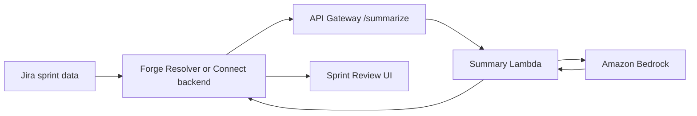

# Atlassian Jira Integration

This guide covers how to connect the Sprint Review Summary API to an Atlassian Jira app.



## Option A: Forge App with Remote Backend (Recommended)

Best for Marketplace apps and production use. Forge handles auth tokens automatically.

### 1. Declare the Remote

In your Forge app's `manifest.yml`:

```yaml
remotes:
  - key: sprint-summary-api
    baseUrl: https://<API_ID>.execute-api.eu-central-1.amazonaws.com/prod
    operations:
      - compute
    auth:
      appSystemToken:
        enabled: true
```

### 2. Deploy This API with Forge JWT Auth

```bash
sam deploy --parameter-overrides \
  AuthMode="forge-jwt" \
  ForgeAppId="ari:cloud:ecosystem::app/<YOUR_APP_ID>"
```

### 3. Create a Forge Resolver

```typescript
// src/resolvers/index.ts
import Resolver from '@forge/resolver';
import { fetch } from '@forge/api';

const resolver = new Resolver();

resolver.define('get-summary', async ({ payload }) => {
  const response = await fetch(
    'https://<API_ID>.execute-api.eu-central-1.amazonaws.com/prod/summarize',
    {
      method: 'POST',
      headers: { 'Content-Type': 'application/json' },
      body: JSON.stringify({
        sprint_data: payload.sprintData,
        prompt_context: {
          additional_instructions: payload.instructions || '',
        },
        model_params: {
          max_tokens: payload.maxTokens,
          temperature: payload.temperature,
        },
      }),
    }
  );

  if (!response.ok) {
    const err = await response.json();
    throw new Error(err.error || `API error: ${response.status}`);
  }

  return await response.json();
});

export const handler = resolver.getDefinitions();
```

### 4. Call from Forge UI

```tsx
import { invoke } from '@forge/bridge';
import { useState } from 'react';

const SprintSummary = ({ sprintData }) => {
  const [summary, setSummary] = useState<any | null>(null);
  const [loading, setLoading] = useState(false);
  const [error, setError] = useState<string | null>(null);

  const generate = async () => {
    setLoading(true);
    setError(null);
    try {
      const result = await invoke('get-summary', { sprintData });
      setSummary(JSON.parse(result.summary));
    } catch (e) {
      setError(e.message);
    } finally {
      setLoading(false);
    }
  };

  return (
    <div>
      <button onClick={generate} disabled={loading}>
        {loading ? 'Generating...' : 'Generate Sprint Summary'}
      </button>

      {error && <div style={{ color: 'red' }}>{error}</div>}

      {summary?.sections?.map((section) => (
        <div key={section.section}>
          <h4>{section.section}</h4>
          <ul>
            {section.bullets.map((b, idx) => <li key={idx}>{b}</li>)}
          </ul>
        </div>
      ))}
    </div>
  );
};
```

---

## Option B: Connect App with API Key

For Connect apps or internal tools that manage their own backend.

### Setup

1. Deploy with `AuthMode=api-key` (the default)
2. Store the API key in your Connect app's environment — **never in frontend code**

### Server-Side Call

```javascript
// Your Connect app's backend
const SUMMARY_API = process.env.SPRINT_SUMMARY_API_URL;
const API_KEY = process.env.SPRINT_SUMMARY_API_KEY;

async function generateSprintSummary(sprintData) {
  const response = await fetch(`${SUMMARY_API}/summarize`, {
    method: 'POST',
    headers: {
      'Content-Type': 'application/json',
      'x-api-key': API_KEY,
    },
    body: JSON.stringify({
      sprint_data: sprintData,
      prompt_context: {
        additional_instructions: 'Return concise executive conclusions only.',
      },
    }),
  });

  if (!response.ok) {
    const err = await response.json();
    throw new Error(err.error);
  }

  return (await response.json()).summary;
}
```

---

## Collecting Sprint Data from Jira

Before calling the summary API, gather sprint data using Jira APIs.

### Using Forge APIs

```typescript
import { jira } from '@forge/api';

async function getSprintData(boardId: number, sprintId: number) {
  const sprint = await jira.agile.sprint.getSprint({ sprintId });

  const { issues } = await jira.agile.board.getIssuesForSprint({
    boardId,
    sprintId,
    fields: ['summary', 'status', 'issuetype', 'story_points', 'assignee'],
  });

  const done = issues.filter(
    (i) => i.fields.status.statusCategory.key === 'done'
  );
  const notDone = issues.filter(
    (i) => i.fields.status.statusCategory.key !== 'done'
  );

  return {
    sprint: {
      name: sprint.name,
      goal: sprint.goal,
      startDate: sprint.startDate,
      endDate: sprint.endDate,
      state: sprint.state,
    },
    metrics: {
      totalIssues: issues.length,
      completedIssues: done.length,
      incompleteIssues: notDone.length,
    },
    completedIssues: done.map((i) => ({
      key: i.key,
      summary: i.fields.summary,
      type: i.fields.issuetype.name,
      assignee: i.fields.assignee?.displayName,
    })),
    incompleteIssues: notDone.map((i) => ({
      key: i.key,
      summary: i.fields.summary,
      type: i.fields.issuetype.name,
      assignee: i.fields.assignee?.displayName,
    })),
  };
}
```

### Using Jira REST API (Connect)

```javascript
const boardId = 1;
const sprintId = 42;

// Get sprint
const sprint = await fetch(
  `/rest/agile/1.0/sprint/${sprintId}`,
  { headers: { Accept: 'application/json' } }
);

// Get issues in sprint
const issues = await fetch(
  `/rest/agile/1.0/board/${boardId}/sprint/${sprintId}/issue?fields=summary,status,issuetype,story_points,assignee`,
  { headers: { Accept: 'application/json' } }
);
```

### Sprint Data Schema

The API accepts `sprint_data` in **any** JSON structure. The prompt template will serialize it and pass it to the AI. That said, here's the recommended schema for best results:

```json
{
  "sprint": {
    "name": "string",
    "goal": "string",
    "startDate": "YYYY-MM-DD",
    "endDate": "YYYY-MM-DD",
    "state": "active | closed | future"
  },
  "metrics": {
    "totalIssues": 0,
    "completedIssues": 0,
    "incompleteIssues": 0,
    "totalStoryPoints": 0,
    "completedStoryPoints": 0
  },
  "completedIssues": [
    {
      "key": "PROJ-123",
      "summary": "Issue title",
      "type": "Story | Bug | Task",
      "storyPoints": 0,
      "assignee": "Name",
      "epic": "Epic name (optional)"
    }
  ],
  "incompleteIssues": [
    {
      "key": "PROJ-456",
      "summary": "Issue title",
      "type": "Story",
      "storyPoints": 0,
      "assignee": "Name",
      "reason": "Why it wasn't completed (optional)"
    }
  ]
}
```

The more structured data you provide, the better the summary quality.
