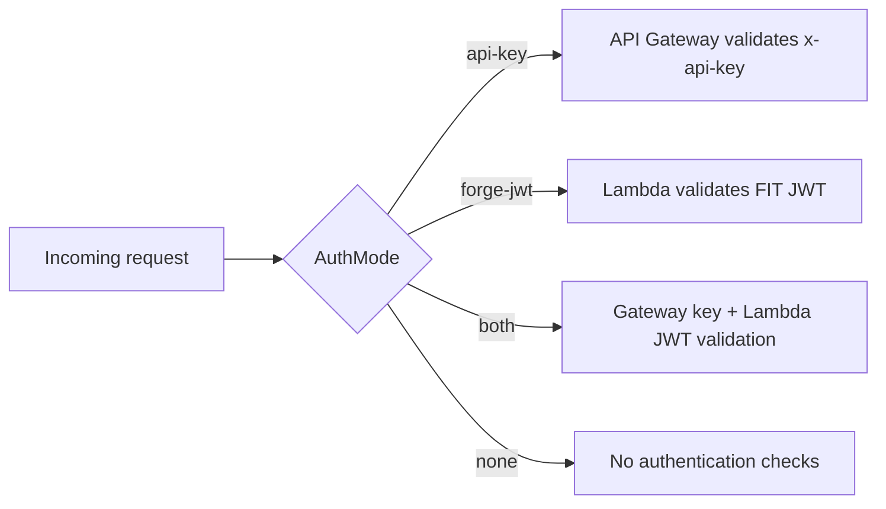

# Authentication

The API supports four authentication modes, configured via the `AuthMode` SAM parameter at deploy time.



## Modes

| Mode | Header Required | Use Case |
|------|----------------|----------|
| `api-key` (template default) | `x-api-key: <key>` | Simple setup. API Gateway manages keys. |
| `forge-jwt` | `Authorization: Bearer <jwt>` | Atlassian Forge apps (FIT validation). |
| `both` | Both API key + JWT | Maximum security. |
| `none` | None | Development / testing only. |

Set it at deploy time:

```bash
sam deploy --parameter-overrides AuthMode="forge-jwt"
```

## API Key Authentication

This is the simplest option. API Gateway handles key validation before your Lambda even runs.

**What you get automatically:**

- An API key created per deployment
- Rate limiting: 5 requests/second sustained, burst to 10
- Monthly quota: 1,000 requests
- Key validation at the gateway level (zero Lambda cost for invalid keys)

**How to use it:**

```bash
curl -X POST https://<endpoint>/prod/summarize \
  -H "Content-Type: application/json" \
  -H "x-api-key: YOUR_API_KEY_HERE" \
  -d '{"sprint_data": {...}}'
```

**Retrieving the key after deployment:**

```bash
aws apigateway get-api-keys --include-values --region eu-central-1
```

## Forge JWT Authentication

For Atlassian Forge apps that call this API as a remote backend. Forge automatically attaches JWTs to requests when configured.

**How it works:**

1. Your Forge app sends a request with a Forge Invocation Token (FIT) in the `Authorization: Bearer ...` header
2. The Lambda fetches Atlassian's public JWKS keys (cached for 1 hour)
3. It verifies the JWT signature, expiration, and optionally the audience claim

**Deploy with Forge JWT:**

```bash
sam deploy --parameter-overrides \
  AuthMode="forge-jwt" \
  ForgeAppId="ari:cloud:ecosystem::app/YOUR_FORGE_APP_ID"
```

Setting `ForgeAppId` enables audience (`aud`) validation — the JWT must be issued for your specific Forge app.

**JWKS endpoint:** `https://forge.cdn.prod.atlassian-dev.net/.well-known/jwks.json`

## Both Mode

Requires a valid API key **and** a valid Forge JWT. The API key is checked by API Gateway, and the JWT is validated by the Lambda function.

```bash
sam deploy --parameter-overrides AuthMode="both" ForgeAppId="ari:cloud:ecosystem::app/..."
```

## No Auth Mode

Disables all authentication. Only for local development or testing.

```bash
sam deploy --config-env dev
```

The `dev` profile in `samconfig.toml` already sets `AuthMode=none`.

## Health Endpoint

`GET /health` is **always unauthenticated** regardless of `AuthMode`. This allows uptime monitoring without credentials.
