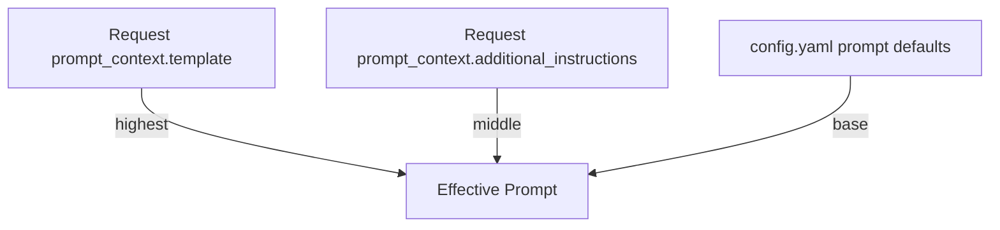

# Prompt Configuration Guide

The prompt is the core of this project. It lives in root `config.yaml` so you can customize behavior without changing Python code.



## File Location

```
config.yaml
```

After editing, redeploy with `sam build && sam deploy`.

## Structure

```yaml
model:
  id: eu.amazon.nova-micro-v1:0
  region: eu-central-1
  max_tokens: 2048
  temperature: 0.3
  top_p: 0.9

prompt:
  role: >
    You are a senior engineering manager writing a concise sprint review summary.
  sections:
    - title: Sprint Overview
      instruction: Sprint name, goal, dates, and completion metrics.
    # Add, remove, or reorder sections as needed.
  formatting:
    output_format: json
    max_words: 450
    tone: professional, concise, executive, data-driven
    rules:
      - Return valid JSON only. No Markdown, no HTML, no code fences.
      - Use this exact top-level shape: {"sections":[{"section":"<title>","bullets":[{"statement":"...","business_value_score":0}]}]}
      - For each section, "bullets" must contain 2-3 objects.
      - Each bullet object must include "statement" and "business_value_score".
      - "business_value_score" must be an integer from -100 to 100.
```

### Fields

| Field | Description |
|-------|-------------|
| `prompt.role` | System role description — sets the AI's persona. |
| `prompt.sections` | Ordered list of summary sections. Each has a `title` and `instruction`. |
| `prompt.formatting.*` | Output format, limits, tone, and rules. |
| `model.*` | Default model parameters (overridable by env vars and per-request params). |
| `auth.*` | Default auth mode and Forge app id. |
| `api.*` | Default allowed origins and log level. |

### Business Value Scoring

Each bullet now includes:
- `statement`: 1-2 sentence conclusion.
- `business_value_score`: integer from `-100` to `100` on a full graded scale that indicates business impact.

Interpretation:
- `-100` to `-1`: negative impact
- `0`: neutral impact
- `1` to `100`: positive impact

Important:
- The score is **not** limited to `-100`, `0`, or `100`.
- Use intermediate values to represent magnitude (for example: `-75`, `-20`, `10`, `45`, `88`).

## Customization Examples

### Shorter, executive-style summary

```yaml
prompt:
  role: >
    You are a product manager writing a brief executive summary.

  sections:
    - title: Highlights
      instruction: Top 3 things shipped, one sentence each.
    - title: Risks
      instruction: Any blockers or concerns in one sentence.

  formatting:
    output_format: json
    max_words: 200
    tone: brief, executive-level
    rules:
      - Return valid JSON only.
      - Keep 2 bullets per section.
```

### Technical sprint retro

```yaml
prompt:
  role: >
    You are a tech lead writing a sprint retrospective for the engineering team.

  sections:
    - title: What Shipped
      instruction: List all merged PRs and features with tech details.
    - title: Technical Debt
      instruction: Identify code quality issues or shortcuts taken.
    - title: Incidents
      instruction: Any production issues during the sprint.
    - title: Architecture Decisions
      instruction: Significant design decisions made.
    - title: Action Items
      instruction: Concrete tasks for the next sprint.

  formatting:
    output_format: json
    max_words: 1200
    tone: technical, candid
    rules:
      - Keep 2-3 bullets per section.
      - Flag any security concerns explicitly.
```

### Multilingual output

```yaml
prompt:
  role: >
    You are a project manager writing a sprint summary in German.

  formatting:
    tone: professionell, prägnant
    rules:
      - Write the entire summary in German.
      - Keep ticket keys in English (e.g. PROJ-123).
```

## Override Precedence

There are three ways to control behavior, from highest to lowest priority:

| Priority | Method | Scope |
|----------|--------|-------|
| 1 | `prompt_context.template` in request body | Per-request. Replaces `config.yaml` prompt entirely. |
| 2 | `prompt_context.additional_instructions` in request body | Per-request. Appended to the prompt. |
| 3 | Edit `config.yaml` and redeploy | Project default for all requests. |

### Per-Request Template Override

Send a complete template in the request body. Must contain `{sprint_data}`:

```json
{
  "sprint_data": { ... },
  "prompt_context": {
    "template": "Summarize this sprint in exactly 3 bullet points:\n\n{sprint_data}"
  }
}
```

### Per-Request Additional Instructions

Append extra instructions without replacing the base prompt:

```json
{
  "sprint_data": { ... },
  "prompt_context": {
    "additional_instructions": "Focus only on bugs and blockers. Ignore completed features."
  }
}
```

## Model Parameters

Model behavior is controlled at three levels:

| Priority | Source | Example |
|----------|--------|---------|
| 1 | `model_params` in request body | `{"model_params": {"temperature": 0.1}}` |
| 2 | Environment variables (SAM parameters) | `BEDROCK_TEMPERATURE=0.5` |
| 3 | `model` in `config.yaml` | `temperature: 0.3` |

### Parameter Reference

| Parameter | Range | Default | Effect |
|-----------|-------|---------|--------|
| `max_tokens` | 1–4096 | 2048 | Max length of generated summary. |
| `temperature` | 0.0–1.0 | 0.3 | Lower = more deterministic, higher = more creative. |
| `top_p` | 0.0–1.0 | 0.9 | Nucleus sampling. Lower = more focused vocabulary. |
| `model_id` | string | `eu.amazon.nova-micro-v1:0` | Which Bedrock model/inference profile to use. |
